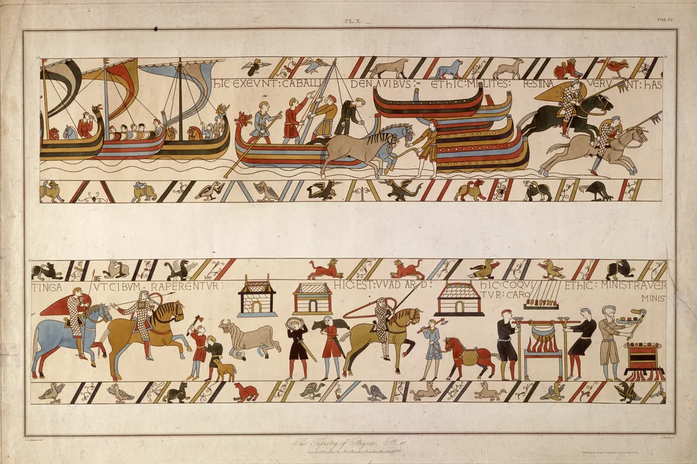
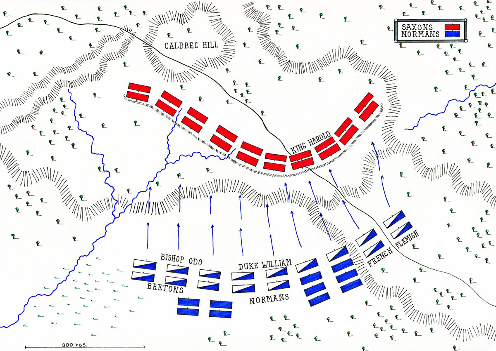
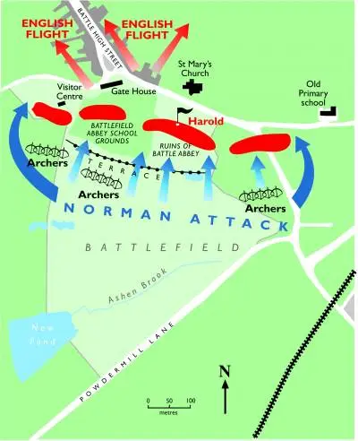
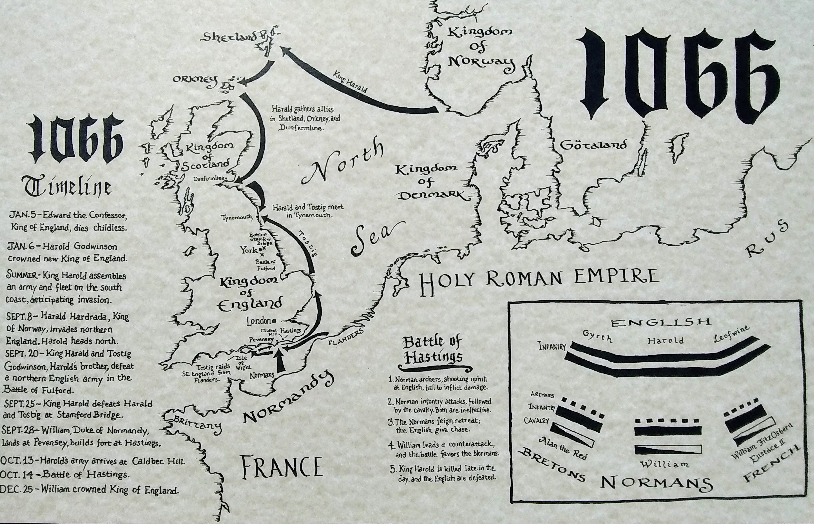

# Battle of Hastings (1066 CE)

## Overview
- **Date:** October 14, 1066  
- **Location:** Near Hastings, England  
- **War/Campaign:** Norman Conquest of England  
- **Belligerents:** Normans vs. Anglo-Saxons  
- **Commanders & Leaders:** William, Duke of Normandy vs. King Harold II  
- **Strength:** ~7,000 each side  
- **Casualties:** Thousands on both sides; Harold killed.  
- **Outcome:** Norman victory.  
- **Significance:** Beginning of Norman rule in England.  

---

## Background
Edward the Confessor dies without heir; succession crisis pits Harold vs. William.  

---

## The Battle
- **Deployment:** Saxons formed a shield wall on a hill; Normans attacked uphill.  
- **Tactics:** Norman feigned retreats broke the Saxon line.  
- **Course of Battle:** Long, brutal fight ending with Harold’s death.  

---

## Aftermath
William crowned King of England; major cultural shift toward Norman influence.  

---

## Maps & Visuals
- **Bayeux Tapestry (Norman fleet and battle scenes)**  
  

- **Battlefield deployment map (Saxons vs. Normans)**  
  

- **Tactical map (Norman attack and English flight)**  
  

- **1066 invasion routes & campaign timeline**  
  

---

## Sources (MLA Preferred)
- Primary: Bayeux Tapestry, Norman chronicles.  
- Secondary: Marc Morris, *The Norman Conquest*.  
